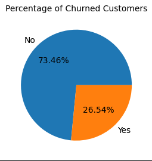
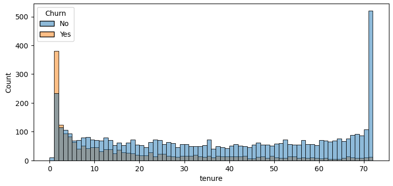
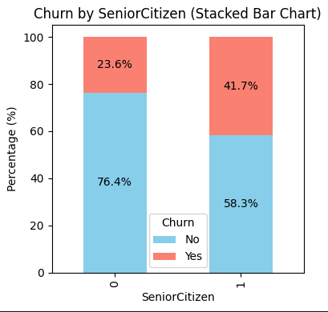

# Customer Churn Analysis

## Project Overview
This project analyzes customer churn data using Python to identify the factors that influence customer retention and churn.

## Objective
- Analyze customer behavior.
- Identify key churn factors.
- Provide business recommendations to improve customer retention.

## Tools Used
- Python
- Pandas
- NumPy
- Matplotlib
- Seaborn
- Jupyter Notebook

## Files
- TCA.ipynb – Analysis notebook
- Customer Churn.csv – Dataset
- Telco Customer Churn Analysis.pdf – Project report
- requirements.txt – Required Python libraries

## Key Insights
- Customers with Month-to-Month contracts have the highest churn.
- Short-tenure customers are more likely to churn.
- Electronic Check users show higher churn rates.
- Fiber Optic customers have relatively higher churn.

## Conclusion
The analysis highlights customer segments at higher risk of churn and provides actionable recommendations to improve customer retention.

## Key Visualizations

### Churn Distribution

### Contract Type vs Churn

### Tenure Distribution

### Payment Method Analysis

### Internet Service Analysis

### Senior Citizen Churn Analysis

